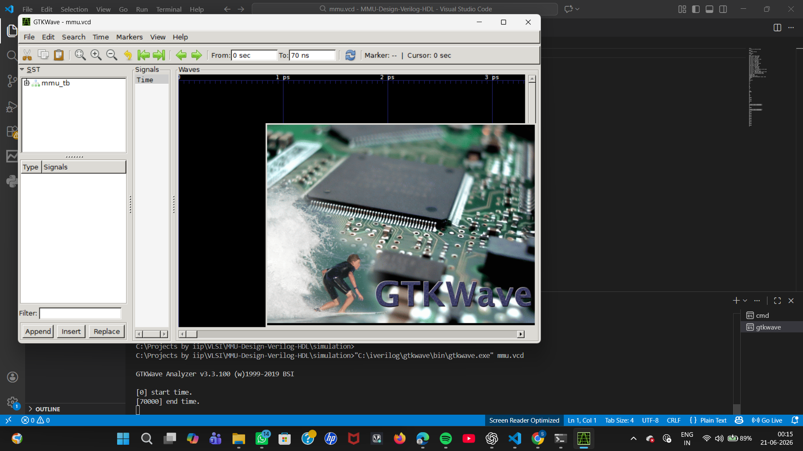
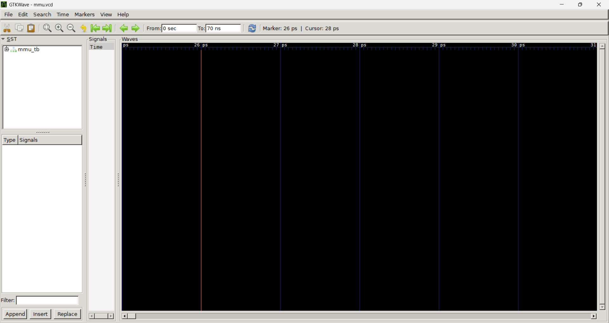
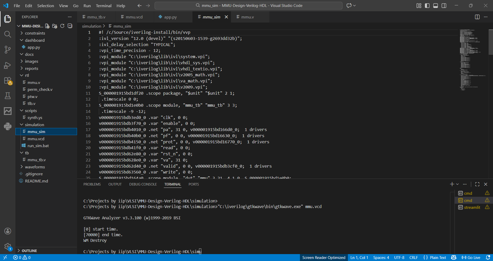
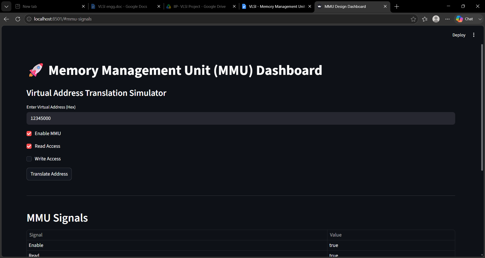
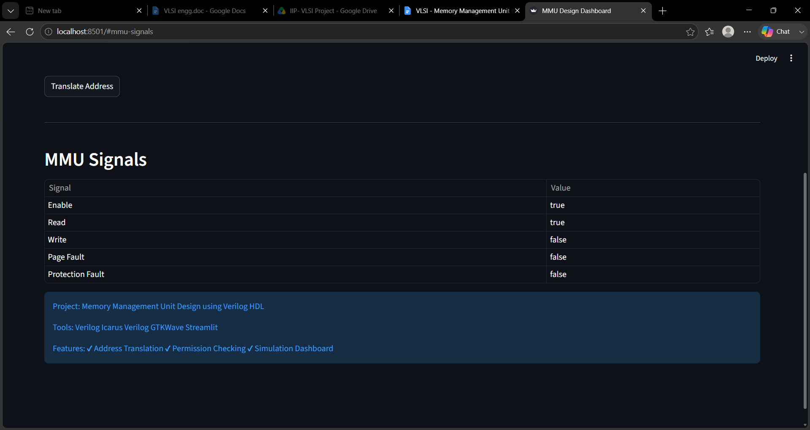

```

# 🚀 Memory Management Unit (MMU) Design using Verilog HDL

<p align="center">


</p>


# 📌 Project Overview

This project implements a **Memory Management Unit (MMU)** using **Verilog HDL**.

The MMU is a critical hardware block used in modern processors to translate **virtual addresses into physical addresses** while providing memory protection and access control.

This project demonstrates concepts from:

- VLSI Design
- Digital Logic Design
- Computer Architecture
- Operating Systems
- RTL Design
- Hardware Verification


---

# 🎯 Project Objectives

The main objectives are:

- Design an MMU architecture in Verilog
- Implement virtual-to-physical address translation
- Create RTL modules for memory translation
- Implement permission checking
- Generate fault signals
- Verify design using simulation
- Analyze waveforms using GTKWave
- Build a GitHub-ready VLSI portfolio project


---

# 🧠 What is an MMU?

A Memory Management Unit is a hardware component inside CPUs that converts:

```

Virtual Address
|
v
Physical Address

```

Programs use virtual addresses, but actual RAM uses physical addresses.

The MMU performs this translation.


---

# 🏗️ Architecture


```

```
         CPU

          |
          |
    Virtual Address

          |
          v

  Page Number Extraction

          |
          v

      TLB Lookup

          |
          v

   Page Table Translation

          |
          v

  Permission Checking

          |
          v

    Physical Address

          |
          v

    Fault Detection
```

```


---

# 🔑 Features Implemented


✅ Virtual Address Translation

✅ Page Number Extraction

✅ Offset Extraction

✅ Physical Address Generation

✅ Permission Checking

✅ Page Fault Logic

✅ RTL Simulation

✅ GTKWave Verification

✅ Streamlit Dashboard


---

# 📂 Project Structure


```

MMU-Design-Verilog-HDL/

│
├── rtl/
│   ├── mmu.v
│   ├── tlb.v
│   ├── ptw.v
│   └── perm_check.v
│
├── tb/
│   └── mmu_tb.v
│
├── simulation/
│   └── run_sim.bat
│
├── waveforms/
│
├── reports/
│
├── images/
│   ├── dashboard1.png
│   ├── dashboard2.png
│   ├── gtkwave_valid_translation.png
│   ├── simulation_pass1.png
│   └── simulation_pass2.png
│
├── scripts/
│
├── constraints/
│
├── docs/
│
└── README.md

```


---

# ⚙️ Technology Stack


## Hardware Description Language

- Verilog HDL


## Simulation Tools

- Icarus Verilog


## Waveform Analysis

- GTKWave


## Development Environment

- VS Code


## Dashboard

- Streamlit


---

# 🔄 Address Translation Flow


Example:

```

Virtual Address

0x12345000

```
    |

    v
```

Page Number

0x12345

```
    |

    v
```

Offset

0x000

```
    |

    v
```

Physical Address

````


---

# 🧪 Verification


The testbench verifies:


### 1. Reset Operation

Checks correct initialization.


### 2. Address Translation

Checks virtual address conversion.


### 3. Read Access

Checks valid read operation.


### 4. Write Access

Checks permission handling.


### 5. Output Signals

Checks:

- Valid Translation
- Page Fault
- Protection Fault


---

# ▶️ Simulation


Compile:


```bash
iverilog -g2012 -o mmu_sim ../tb/mmu_tb.v ../rtl/mmu.v
````

Run:

```bash
vvp mmu_sim
```

Generate waveform:

```bash
gtkwave mmu.vcd
```

---

# 📊 Simulation Results

## Simulation Output





---

# 🌊 GTKWave Verification

Waveform analysis showing successful address translation.



---

# 📱 MMU Dashboard

Interactive Streamlit dashboard for address translation visualization.





---

# 🔬 VLSI Concepts Used

## RTL Design

Designing hardware modules using Verilog.

## Combinational Logic

Used for:

* Address extraction
* Permission checking

## Sequential Logic

Used for:

* Clock based operations
* Registers

## Hardware Verification

Using testbench and waveform analysis.

---

# 🌍 Industry Relevance

MMU concepts are used in:

* CPU processors
* ARM architecture
* Embedded processors
* Operating systems
* SoC design
* Secure computing

This project represents the fundamentals used in processor design teams.

---

# 🚀 Future Improvements

Future upgrades:

* Advanced TLB architecture
* Set associative cache
* LRU replacement algorithm
* ASID support
* Multi-level page tables
* AXI memory interface
* FPGA implementation
* Low power clock gating

---

# 📸 Evidence / Proof of Work

Included:

✔ RTL Design

✔ Testbench

✔ Simulation Results

✔ GTKWave Analysis

✔ Dashboard Visualization

---

# 👩‍💻 Author

**Sanskritika Awasthi**

---

# ⭐ Learning Outcomes

After completing this project:

* Understanding of MMU architecture
* Virtual memory concepts
* RTL development skills
* Verilog simulation experience
* Hardware verification workflow
* VLSI project documentation

---

# 📜 License

This project is created for educational and VLSI learning purposes.

````

